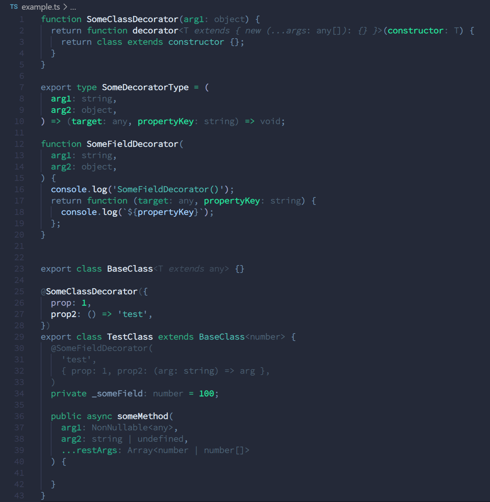
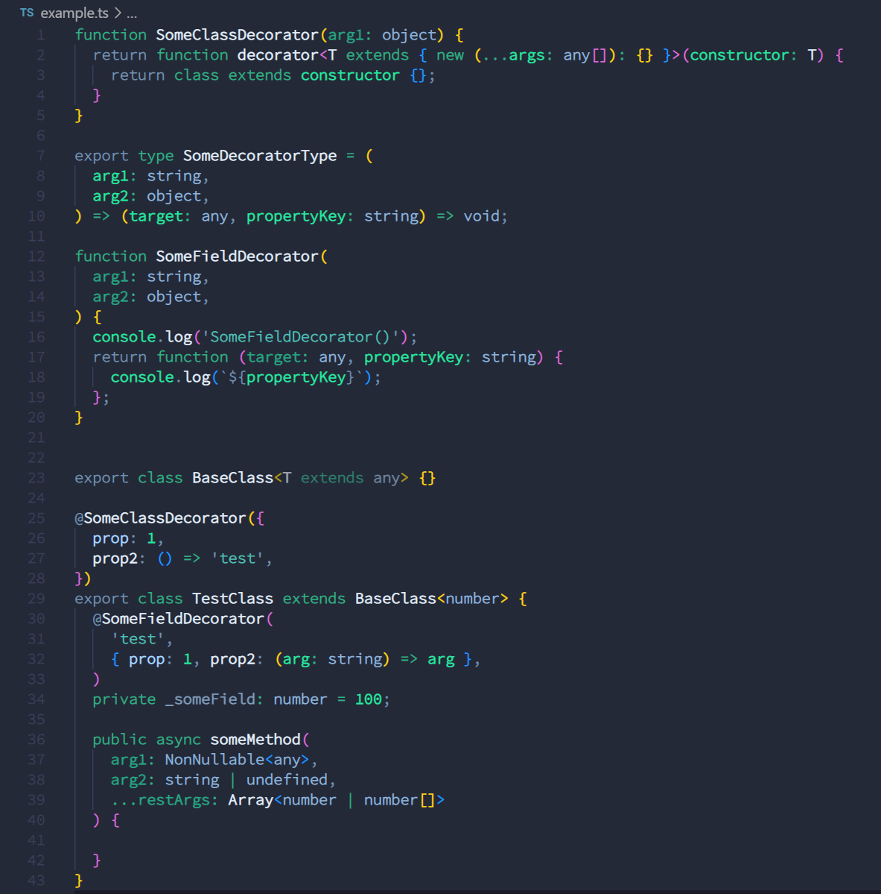

# vscode-dim-typescript-types
VSCode `editor.tokenColorCustomizations` settings to 'dim' TypeScript annotations in order to reduce the visual clutter and mental cognitive load.

Check the `.vscode/settings.json` to find the settings applied to most TypeScript types annotations. It applies a light grey color to simulate dimmed text.

By default, the class decorators settings are commented out, because it is useful for many TS frameworks and libraries that rely a lot on decorators, such as Angular or Nest (which can have a lot of 'code' in modules' decorators), TypeORM, MikroOrm, etc.

The field/methods decorators are dimmed as they usually contains less information and clutter a lot the code (just a personal preference though, feel free to comment the corresponding setting according to your preference).

With dimmed types:

Without dimmed types:

